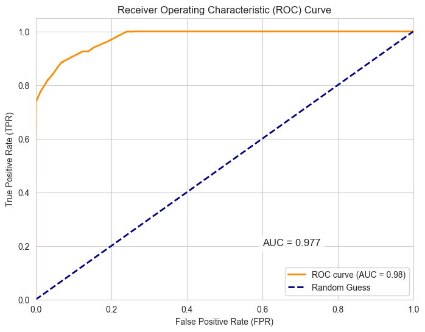

# Financial Fraud Detection System - Technical Documentation


## Table of Contents
- [Project Overview](#project-overview)
- [Key Features](#key-features)
- [Installation & Setup](#installation--setup)
- [Project Structure](#project-structure)
- [Running the Application](#running-the-application)
- [Technical Documentation](#technical-documentation)
- [Requirements](#requirements)
- [License](#license)

---

## Project Overview
This system uses the **Gradient Boosting Algorithm** to detect fraudulent financial transactions with high accuracy. The project covers the complete pipeline from data analysis to UI implementation, including a Streamlit-based interface for real-time processing and result visualization.



---

## Key Features
- 🕵️ Exploratory Data Analysis (EDA) with 7+ professional visualizations
- 🚀 Model with 98% AUC-ROC accuracy
- 📊 Web-based UI using Streamlit
- 🔄 Real-time data processing capability
- 📈 Comprehensive documentation

---

## Installation & Setup

### Prerequisites
- Python 3.10+
- pip

### Installation Steps:
```bash
git clone https://github.com/tushar8057/fraud-detection.git
cd fraud-detection
pip install -r requirements.txt
```

---

## Project Structure
```
fraud-detection/
├── apps/                  # Core application code
│   ├── src/              # Processing modules
│   └── data/             # Data processing & splitting
├── model/                # Trained model
│   └── gb_classifier.pkl
├── notebooks/            # Data analytics and model training
│   └── Fraud_Detection_EDA_Model_Training_EN.ipynb
├── visualizations/       # Visualization outputs
│   ├── confusion_matrix_test.png
│   └── roc_curve.png
        ...
├── .gitignore
├── app.py                # Application entry point
├── README.md
└── requirements.txt
```

---

## Running the Application
To launch the web interface:
```bash
streamlit run app.py
```

---

## Technical Documentation

### 1. Dataset
- **File Name:** `fraud_dataset_mod.csv`
- **Key Characteristics:**
  - 17 numerical & categorical features
  - 50,001 records
  - Balanced using RandomUnderSampler

### 2. Model
- **Algorithm:** Gradient Boosting Classifier + RandomUnderSampler
- **Accuracy:** 98% AUC-ROC
- **Input:** 12 processed features
- **Output:** Fraud probability (0-1)

### 3. Visualizations
| File Name | Description |
|----------|---------|
| `categorical_distribution.png` | Categorical feature distribution |
| `numeric_features_boxplot.png` | Outlier analysis |


---

## Deployment

This project is deployed on **Render** for free hosting.  

🔗 **Live Demo:** [Fraud Detection System on Render](https://fraud-detection.onrender.com)  

### Steps to Deploy on Render:
1. Push your project to GitHub (make sure `requirements.txt` and `app.py` are present).
2. Go to [Render](https://render.com).
3. Create a **New Web Service**.
4. Connect your GitHub repository.
5. Set the following configuration:
   - **Build Command:**  
     ```bash
     pip install -r requirements.txt
     ```
   - **Start Command:**  
     ```bash
     streamlit run app.py --server.port=$PORT --server.address=0.0.0.0
     ```
6. Deploy! 🎉  

Now, your project will be live on a Render URL which you can share.


## Requirements
Full requirements list available in [`requirements.txt`](requirements.txt)

---

## License
This project is licensed under the [MIT](LICENSE) License.

---

👋 We hope you find this project useful! 🚀

## Contact Developer  
🔗 GitHub Profile: [tushar-8057](https://github.com/tushar8057)
